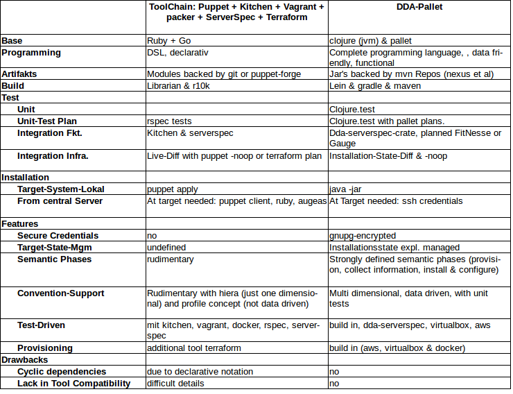

# dda-pallet
Anyone who has so far dealt with Infrastructure as Code has to deal with a mix of Ruby, Python and go. If you want to get more from the Java world and always wanted to try functional programming, there is now a worthy & fresh alternative: "dda-pallet". Dda-pallet is OpenSource, written in clojure, running on the proven Java Virtual Machine.
dda-pallet provides the whole tool-chain from one hand, is real modular, testable and well prepared for configuration data handling.

## compatability
dda-pallet is compatible to the following versions
 * pallet 0.8
 * clojure 1.7
 * (x)ubunutu14.04

## Principles
 * Distinction between installation and configuration: We distinguish between seldom installation and continuous configuration.
 * Explicit State: We collect all the system state information to a defined place.
 * Full Modularization: We separate our modules into common usable system adapters and company specific convention modules. Beside this general principle we are using the full tool stack provided by clojure.
 * Configuration is data: In order to keep the interface simple, clean & isolated, we handle all configuration as data. There is no magic hidden in.
 * Test Driven DevOps: Configuration as data makes it easy, to do unit tests. For the system adapters we are heading towards to state of the art integration tests - comparable to kitchen / vagrant / server-spec.

##More information
* dda-pallet is a clojure based config management system build upon the great config management framework [pallet](https://github.com/pallet/pallet) build by to Hugo Duncan.
* [Requirements & Architecture](https://dda.gitbooks.io/domaindrivenarchitecture/content/en/80_config_management/index.html)
* [Presentations from Hugo Duncan & Anton Batichelli](http://lanyrd.com/2012/clojurewest-training/spdbh/], (and)[http://lanyrd.com/2012/clojurewest/spdcf/)

## Comparison Puppet vs. dda-pallet

# License
Published under [apache2.0 license](LICENSE.md)
